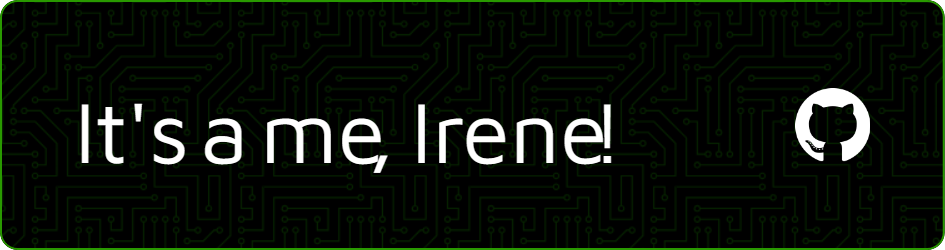

# Hi! 👋

## About me

Technically I am an **engineer**, but a few years ago I discovered that the world of **programming is much more interesting to me.**

I did a frontend bootcamp when I didn't know anything about programming where I saw the essentials, ,  and  in addition to ,  and other things. In the bootcamp my group and I did a project where we tested our skills using , ,  and , while developing teamwork and working through the agile methodology. After that, I have been studying more tools from the frontend world, like  and .

Nowadays, I have been working for over a year as a programmer in a consulting company, facing new challenges every day and continuously learning. In my role, I work with different programming languages and technologies, collaborate in professional environments, and take part in deployment and production release processes, gaining a solid understanding of how projects move from development to production.

Alongside my professional work, I keep practicing and experimenting by developing personal projects, which I usually upload to my personal website, [irenealcainealvarez.es](https://irenealcainealvarez.es/). I really enjoy working with  and continuing to expand my skills while building and refining my portfolio.

Ask me anything! -> 
  

  [^2]
[^2]: The Office reference: ✅

## Github stats

